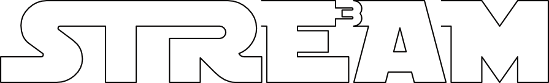

# STRE3AM
### Strategic Technology Roadmapping, and Energy, Environmental, and Economic Analysis Model

  

The Strategic Technology Roadmapping and Energy, Environmental, and Economic
Analysis Model **STRE3AM** is an optimization-based modeling tool and
analysis framework to assist with strategic planning and technology investments
of the industrial sector. This open-source framework is written in Julia using
JuMP objects, which enables users to model future *pathways* for incumbent and
future production technologies, fuels and energy carriers, emissions, and other
impacts from industries as they transform in pursuit of a robust, competitive,
resilient, and sustainable manufacturing sector. The model starts with an
initial stock of industrial production technologies and assets at a facility
level or an aggregated national level, and then determines pathways that
minimize cost or similar economic objective(s), subject to an array of
constraints on demand, annual or cumulative emissions, market shares, and other
exogenously specified operational considerations such as capacity utilization
rates or regional availability of feedstocks and energy sources. Key features of
the framework include flexibility to model a wide range of industries and
industrial technologies/processes at varying levels of granularity from
facility-level to regional or national level, ability to perform parametric
sensitivity analyses, and ability to visualize model results using visualization
objects.

## Documentation

[Documentation](https://dthierry.github.io/stre3am/).

## Source Code Organization

|  Directory | Description       |
|------------|-------------------|
| test/      | testing files     |
| instance/  | case studies      |
| data/      | instance data     |
| src/       | source code       |
| docs/      | documentation src |

## Contributors

- David Thierry, Argonne National Laboratory, *ESIA division*
- Sarang Supekar, Argonne National Laboratory, *ESIA division*

## License
 
STRE3AM (`stre3am`) is licensed under the 3-Clause BDS licence.
Additionally, STRE3AM (`stre3am`) utilizes several dependencies, which
have their own licences. Please refer to their respective repositories for more
information about the licenses. 

